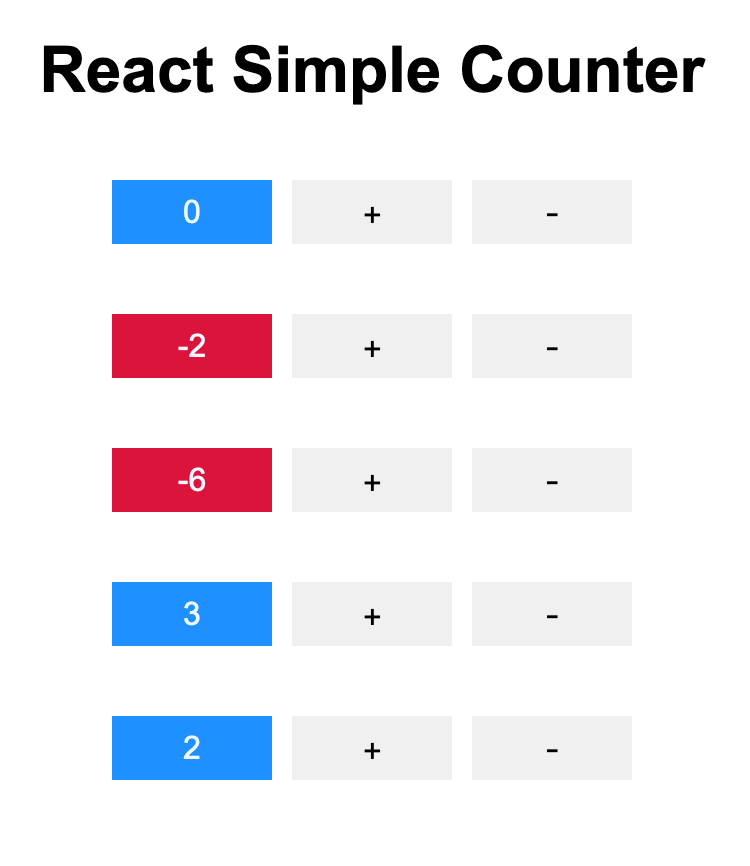

# react-simple-counter

⏱ A simple counter app built in React



## Objectives

What you will learn in this exercise

- Set the initial `state` from `props`
- Update `state` from its previous `state`
- Add CSS classes to components
- Publish your app on GitHub Pages

## Instructions

We will be building a simple counter app in React. See the [demo](https://thoughtworks-jumpstart.github.io/react-simple-counter/) of the final app.

Your task is to build a `Counter` component which displays a counter and contains two buttons - one to increment the counter and the other to decrement the counter.

One way to do this is to first start with HTML and then convert it to JSX using a tool like [HTMLtoJSX](https://magic.reactjs.net/htmltojsx.htm)

Next, we will create functions that will handle when a button is clicked using the `onClick` attribute.

So far, we have only one component. We can logically split them up into separate components.

Next up, using the `className` attribute let's dynamically add CSS classes to change the color of the counter. For instance, display the counter as red when it is a negative value and green when it is a positive value.

Finally, we will create multiple `Counter` components with varying initial count values and render them all to the DOM.

## Handling events

You do not need to call `addEventListener` to add listeners to a DOM element. Instead, React uses the `onClick` attribute which accepts a callback to handle events.

```js
<button onClick={this.handleClick}>
```

### Passing arguments to event handlers

There may be times you want to pass arguments to an event handler. Either of the following would work:

```js
<button onClick={(event) => this.deleteRow(id, event)}>Delete Row</button>
<button onClick={this.deleteRow.bind(this, id)}>Delete Row</button>
```

### Binding `this` to your event handlers

At this point you may encounter issues with `this` when passing functions as `props` to other components. There are several ways to solve this issue.

One way is to add `this.handleClick = this.handleClick.bind(this);` inside the `constructor` method.

```js
class Toggle extends React.Component {
  constructor(props) {
    super(props);
    this.state = {isToggleOn: true};
    this.handleClick = this.handleClick.bind(this);
  }

  handleClick() {
    this.setState(state => ({
      isToggleOn: !state.isToggleOn
    }));
  }

  render() {
    return (
      <button onClick={this.handleClick}>
        {this.state.isToggleOn ? 'ON' : 'OFF'}
      </button>
    );
  }
}
```

Another way is to simply bind `this` when passing it to `onClick` like this

```js
<button onClick={this.handleClick.bind(this)}>
```

Since arrow functions implicitly bind `this`, you can also wrap it around an arrow function like this

```js
<button onClick={() => this.handleClick}>
```

Finally, there's also the public class fields syntax

```js
handleClick = () => {
  console.log('this is:', this);
}
```

## Styling and CSS

### `className` attribute

To add a CSS class to a React element use the `className` attribute and then add the CSS rules for that class in a CSS file like `style.css`. You may optionally use the [`classnames` package](https://www.npmjs.com/package/classnames#usage-with-reactjs) to construct CSS classes.

```js
<header className="header">Hello, world!</header>

<main className="my-first-class my-second-class">Some amazing content here!</main>

<footer className={this.props.style}>Built with ❤️ by JumpStarters</footer>
```

### `style` attribute

You can also use the [`style` attribute](https://reactjs.org/docs/dom-elements.html#style) and pass in a JavaScript object. It uses camelCase properties like `backgroundColor` instead of `background-color`, which is consistent with the DOM `style` JavaScript property (e.g. `body.style.fontSize`)

```js
const divStyle = {
  color: 'blue',
  backgroundImage: 'url(' + imgUrl + ')',
};

function HelloWorldComponent() {
  return <div style={divStyle}>Hello World!</div>;
}
```

Do note that the official React documentation states that, while convenient, "using the `style` attribute as the primary means of styling elements is generally not recommended."

CSS classes are generally better for performance than inline styles.

### CSS-in-JS

Another option is to use something called CSS-in-JS, where CSS is composed within JavaScript instead of defined in external files. A comparison of numerous third-party libraries that are available can be found [here](https://michelebertoli.github.io/css-in-js/).

## Component reuse

Since components are reusable, we can add as many components to our app as we want.

Here's one way you can add multiple components

```
function App() {
  return (
    <React.Fragment>
      <Hello name="Alice" />
      <Hello name="Bob" />
      <Hello name="Cindy" />
    </React.Fragment>
  )
}
```

Another way is to first define an array and then use `map()` to create a new array of React elements

```
function App() {
  const names = ['Alice', 'Bob', 'Cindy']

  return (
    <React.Fragment>
      {names.map(name => {
        return <Hello name={name} />
      })}
    </React.Fragment>
  )
}
```

## Publish your app to GitHub Pages

Publish your app by going into settings in your GitHub repository. Under the header **GitHub Pages**, select the `master` branch as your source.

Your app should be published here `https://<username>.github.io/<repo-name>`

References

- [Handling events](https://reactjs.org/docs/handling-events.html)